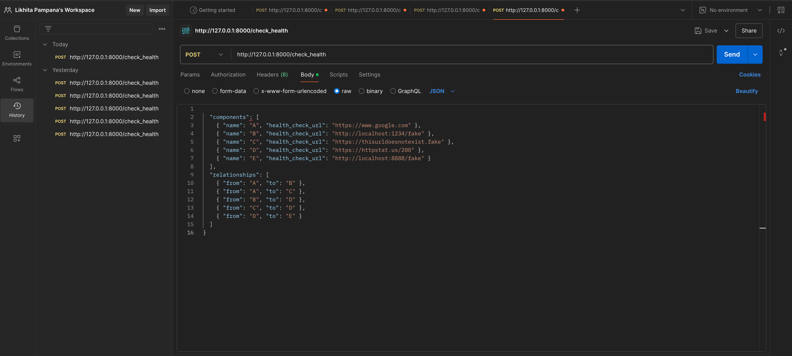
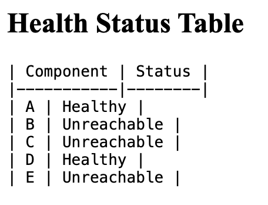
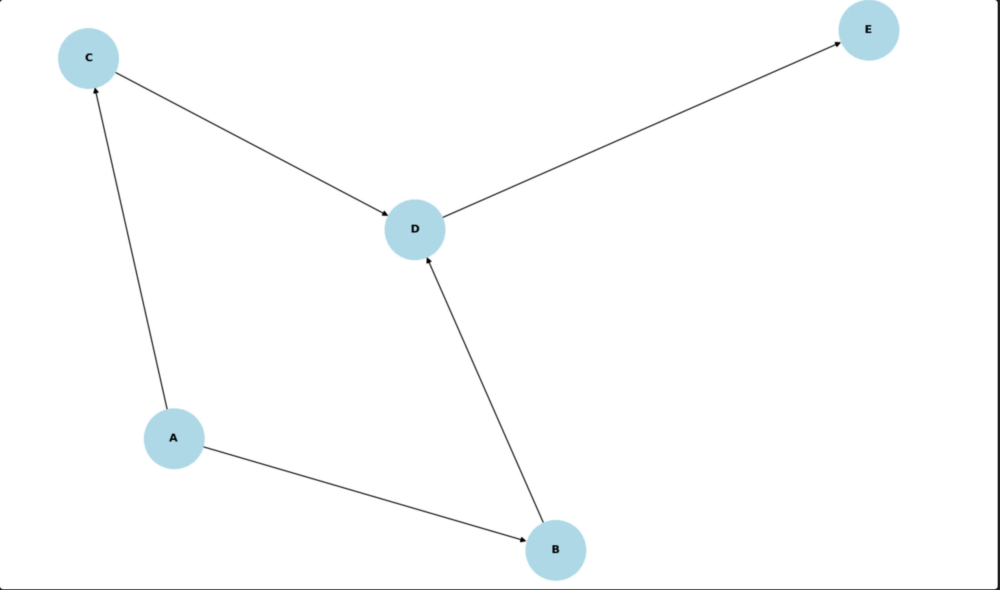

# PULSE DAG MONITOR 
#  System Health Checker (Dependency-Aware)

Hi there! 👋  
This is a simple but powerful project that checks the health of a system made up of multiple components that depend on each other — like services in a microservices architecture.

It doesn't just ping everything randomly. Instead, it understands dependencies between components, checks them smartly, and even shows you a visual graph of the entire system!

---

## ✨ What This Does

- Accepts system information (components + their health check URLs + dependencies).
- Checks each component's health via real HTTP calls.
- Handles unreachable services gracefully.
- Draws a clear, beautiful system graph.
- Presents the results in a clean HTML page (health table + graph).

---

## 🛠️ Technologies Used

- **Python 3.8+**
- **FastAPI** (for building the web server)
- **aiohttp** (to make async HTTP requests)
- **NetworkX** (to model the system as a graph)
- **Matplotlib** (to generate the system diagram)

---

## 🚀 How to Run This Project

Even if you don't have Python installed yet — no worries!  
Just follow these steps:

### 1. Install Python (if you don’t have it)

Go here 👉 [https://www.python.org/downloads/](https://www.python.org/downloads/) and install Python 3.10+.

*(Make sure to check "Add Python to PATH" during installation!)*

---

### 2. Clone the Project

```bash
git clone <your-repo-url>
cd <your-project-folder>
```

---

### 3. Set Up a Virtual Environment

This is optional but recommended.

```bash
python -m venv venv
# Activate the environment:
# On Windows:
venv\Scripts\activate
# On Mac/Linux:
source venv/bin/activate
```

---

### 4. Install the Required Libraries

```bash
pip install -r requirements.txt
```

---

### 5. Start the Server

```bash
uvicorn main:app --reload
```

---

### 6. Open Postman to hit the endpoint using a POST Method

Once the server is running, open:

```
http://127.0.0.1:8000/check_health`
```
Pass the sample Json in the Body and Headers as JSON

---

## Sample Input (JSON)

Here's a ready-to-go sample:

```json
{
  "components": [
    { "name": "A", "health_check_url": "https://www.google.com" },
    { "name": "B", "health_check_url": "http://localhost:1234/fake" },
    { "name": "C", "health_check_url": "https://thisurldoesnotexist.fake" },
    { "name": "D", "health_check_url": "https://httpstat.us/200" },
    { "name": "E", "health_check_url": "http://localhost:8888/fake" }
  ],
  "relationships": [
    { "from": "A", "to": "B" },
    { "from": "A", "to": "C" },
    { "from": "B", "to": "D" },
    { "from": "C", "to": "D" },
    { "from": "D", "to": "E" }
  ]
}
```

---

##  What You’ll See in the Response Tab

- A table that looks like this:


- A full graph diagram showing the system layout!

---

## Project Structure

```
.
├── main.py              # FastAPI application
├── health_checker.py    # Core health-checking logic
├── requirements.txt     # All dependencies
├── README.md            # You're reading it right now!
└── sample_data.json     # Example input file
```

---

## Assumptions and Design Decisions

### Assumptions

- Every **component** has a **unique name**.
- If a health check URL returns **HTTP 200**, it is considered **Healthy**.
- Any other HTTP status = **Unhealthy**.
- If the URL is unreachable (timeout, DNS error, etc.) = **Unreachable**.
- The system forms a **Directed Acyclic Graph (DAG)** — no loops/cycles.
- Health checking starts from **root nodes** (no incoming edges).

---

### Why Breadth-First Search (BFS)

- As Intended in the ask for assessment 
- BFS ensures that we check components **layer by layer**.
- It respects dependencies — a child component is checked **after** its parent services.
- It's simple and predictable — easy to debug and scale.

---

### How the System Graph is Created

- Built using **NetworkX**.
- Visual layout uses `spring_layout` for clean node spacing.
- Graph is generated as a **base64 inline image** and embedded in the HTML response.

---

###  HTTP Call Handling

- All HTTP calls are made using **aiohttp** (async for speed).
- If a service times out or cannot be resolved, it is safely marked **Unreachable**.
- No retries/backoff were added (kept intentionally simple).


##  Final Note

This project was designed to be simple, smart, and close to real-world systems.  
Instead of blindly pinging everything, it understands and respects **system dependencies** — just like we expect in production environments.

Hope you enjoy exploring it as much as I enjoyed building it! 
